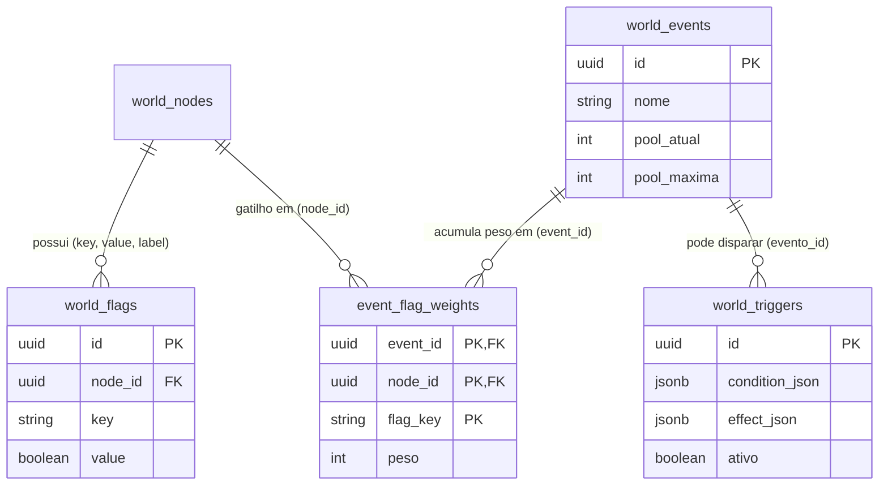
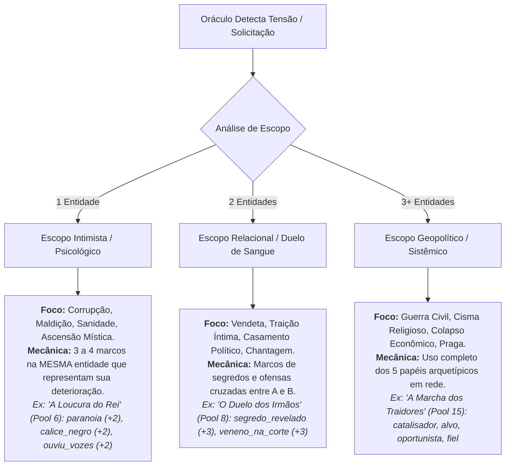
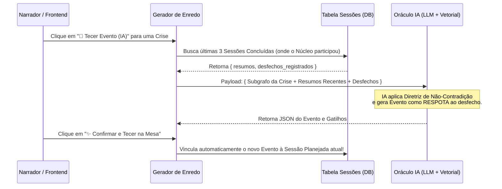

# Guia de Arquitetura e Especificação: Gerador de Enredo e Tecelagem de Destinos por IA

Este documento estabelece o guia arquitetônico, metodológico e técnico para a implementação da ferramenta de **Gerador de Enredo, Pílulas de Marcos e Profecias de Eventos (Tecelagem de Destinos)**, unindo o cálculo procedural do Oráculo Matemático com a inteligência generativa do Oráculo IA (LLM + Banco Vetorial).

O objetivo maior desta ferramenta é transformar o gerenciamento burocrático de Marcos (`flags`) e Eventos (`world_events`) em uma **experiência fluida, automatizada e de 1 clique**, onde a IA atua como uma co-narradora especializada em tecer redes de consequências.

---

## 🏛️ Regra de Ouro & Conformidade Arquitetônica (`Arquitetura.md`)

Para garantir zero dívida técnica e respeito ao ecossistema atual, toda a implementação do Gerador de Enredo seguirá estritamente as diretrizes da **Regra de Ouro**:
1. **Zero Frameworks Frontend (Regra 1.1):** Todo o painel de sugestões, botões de pílulas (`1-Click Flags`) e cards de profecia serão implementados em Vanilla JavaScript (`constelacao.js`, `constelacaoTensao.js` ou novo módulo dedicado `geradorEnredo.js`), manipulando o DOM com segurança.
2. **Design System & Tokens (Regra 2.5):** Nenhum estilo estético inline. Toda a UI utilizará as classes e variáveis oficiais do projeto (`var(--dourado)`, `var(--destaque)`, `var(--link-inimigo)`, `var(--bg-afundado)`, etc.) e o padrão de *glassmorphism*.
3. **Blindagem de Injeção & XSS (Regra 2.3 e 6.1):** Textos vindos da IA (nomes de eventos, marcos sugueridos, resumos) passarão obrigatoriamente por `escapeHTML()` antes da inserção no DOM, e todo novo ícone chamará `lucide.createIcons()` após a renderização.
4. **Mutação Otimista com Fallback (Regra 3.2):** Ao confirmar a criação de um evento ou marco sugerido pela IA, a interface assume o sucesso instantaneamente (re-render otimista) e faz o sync com as APIs em background.

---

## 📊 Fatia 1: Análise do Estado Atual do Banco de Dados & Estrutura de Domínio

O modelo relacional atual do nosso backend PostgreSQL/SQLite (observado nos controllers `mundoController.js` e `automacaoController.js`) possui uma estrutura nativamente preparada para relações sistêmicas N:M:



### Análise do Mecanismo Atual:
*   **`world_flags` (Marcos):** Representam os títulos, feitos, trajes, segredos ou estados de uma entidade (`node_id`). São booleanos (`value: true/false`).
*   **`world_events` (Eventos):** Representam contagens regressivas ou pools de tensão (`pool_atual` / `pool_maxima`).
*   **`event_flag_weights` (A Teia de Wiring):** É a tabela associativa que liga um Marco de uma Entidade a um Evento, atribuindo um `peso`. Quando o Marco é ativado (`value = true`), o peso é somado à `pool_atual` do Evento.
*   **Conclusão da Análise:** Não precisamos criar nenhuma nova tabela para suportar a "Tecelagem por IA"! O que nos falta é uma **camada inteligente de orquestração (Payload/Prompt)** que popule simultaneamente `world_flags`, `world_events` e `event_flag_weights` em uma única transação lógica ou sequência de chamadas de API.

---

## 🎭 Fatia 2: O Motor de Arquétipos Narrativos (Role-Binding)

Para prevenir a "preguiça da IA" (a tendência de gerar duelos genéricos e superficiais do tipo *"A e B estão brigando no bar"*), implementaremos um **Contrato de JSON Schema Estrito** com **Role-Binding (Atribuição de Papéis)** no prompt do Oráculo.

Ao solicitar uma profecia de evento, a IA não poderá apenas listar nomes; ela deverá classificar cada entidade envolvida dentro de um **Papel Arquetípico de Crise**:

| Papel Arquetípico | Descrição Mecânica & Narrativa | Peso Recomendado na Pool |
| :--- | :--- | :--- |
| **🔥 Catalisador** | O instigador, o estopim ou o estorvo ativo que força o início da crise. Geralmente é quem acende o primeiro marco. | **Pesado (+3 a +5)** |
| **🎯 Alvo / Vítima** | A entidade, instituição ou líder que sofrerá o impacto devastador se o evento atingir a pool máxima ($100\%$). | **Médio (+2 a +3)** |
| **🦊 Oportunista** | A facção ou NPC que se beneficia em segredo do caos, financiando, espionando ou manipulando os bastidores. | **Moderado (+2 a +3)** |
| **⚖️ Fiel da Balança** | A autoridade moral, militar ou mística cujo apoio ou traição pode interromper a tragédia ou acelerar o colapso. | **Pesado (+4 a +6)** |
| **🗡️ Executor** | A força bruta, exército, assassino ou culto convocado para realizar o ato físico da mudança. | **Ligeiro a Médio (+1 a +3)** |

### Exemplo de JSON Schema Exigido da IA:
```json
{
  "evento_sugestao": {
    "nome": "O Cisma da Águia de Ferro",
    "descricao_curta": "A rebelião das legiões do norte contra a Coroa Imperial.",
    "pool_maxima": 12,
    "escopo": "geopolitico"
  },
  "gatilhos_por_entidade": [
    {
      "node_id": "uuid-do-general-valerius",
      "nome_entidade": "General Valerius",
      "papel_arquetipico": "Catalisador",
      "marco_sugerido": { "key": "lider_separatista", "label": "Líder Separatista", "ativado": true },
      "peso_na_pool": 4
    },
    {
      "node_id": "uuid-do-imperador",
      "nome_entidade": "Imperador Solon",
      "papel_arquetipico": "Alvo",
      "marco_sugerido": { "key": "decreto_de_exilio", "label": "Assinou Decreto de Exílio", "ativado": false },
      "peso_na_pool": 3
    },
    {
      "node_id": "uuid-da-guilda",
      "nome_entidade": "Guilda de Prata",
      "papel_arquetipico": "Oportunista",
      "marco_sugerido": { "key": "financia_rebeldes", "label": "Financiou os Rebeldes em Ouro", "ativado": true },
      "peso_na_pool": 3
    }
  ]
}
```

---

## 📐 Fatia 3: Escopos Narrativos (A Escala de Crise)

Para resolver o ponto de que *"às vezes podem haver problemas entre poucas entidades (1 ou 2), e é necessário algo para isso também sem ser sub-uso"*, nós **não proibiremos** eventos menores. Em vez disso, classificamos os eventos no prompt em **3 Escopos de Intensidade**, garantindo que mesmo um evento de 1 entidade tenha extrema profundidade dramática:



### Regra de Ouro do Escopo no Prompt da IA:
> **Diretriz de Qualidade de Escopo:** "Se o evento envolver apenas 1 entidade, ele **nunca** deve ser uma tarefa trivial; deve ser uma crise existencial, espiritual ou psicológica de alto risco para o personagem e seu núcleo. Se envolver 2 entidades, deve ser um duelo dramático de traição ou segredo letal. Se envolver 3 ou mais, deve ser uma catástrofe ou revolução sistêmica."

---

## ⚙️ Fatia 4: A Engenharia da "Tecelagem Mista" (UX/UI)

A interface com o usuário será dividida em dois pontos de contato principais, unindo a velocidade dos **Kits de 1 Clique** com as **Profecias do Oráculo**:

### 1. Pílulas Arquetípicas por IA no Feixe da Entidade (`1-Click Flags`)
No painel da aba **Marcos** dentro do feixe holográfico de qualquer entidade, adicionaremos a barra de sugestão rápida:
*   **Botão:** `<button class="btn-ia-badges"><i data-lucide="sparkles"></i> Sugerir Marcos (IA)</button>`
*   **Comportamento:** Ao clicar, o frontend envia os dados da entidade (`nome`, `tipo`, `reputacao`, `tarot`, biografia) para o endpoint do Oráculo. A IA devolve um array com 3 sugestões de marcos temáticos.
*   **Renderização na UI:** As pílulas aparecem como chips interativos na tela:
    *   `[ + 🩸 Pacto Secreto com os Elfos ]` `[ + 👑 Herdeiro Bastardo ]` `[ + 👁️ Marca da Besta ]`
*   **Ação Mágica (1 Clique):** Ao clicar no chip, o JavaScript executa imediatamente um `POST /entidades/:id/marcos` com o nome da pílula, já criando o selo no orbe com status `ligado: true`.

### 2. Card de Profecia na Modal de Tensões
Na modal do Oráculo Matemático (`⚡ Tensões`), ao lado de cada diagnóstico procedural detectado, adicionamos o botão:
*   **Botão:** `<button class="btn-profetizar"><i data-lucide="git-merge"></i> Tecer Evento (IA)</button>`
*   **Comportamento:**
    1. O clique envia o subgrafo daquela crise para a IA.
    2. A IA retorna o JSON Schema com o **Evento Sugerido** e a teia de **Gatilhos por Entidade**.
    3. O painel exibe um card de confirmação com a prévia da contagem regressiva e os pesos:
       ```html
       <div class="card-profecia-ia">
           <div class="cp-head">🔮 Profecia: "O Cisma da Águia de Ferro" (Pool 0 / 12)</div>
           <div class="cp-body">
               <div class="cp-item"><strong>General Valerius</strong> (Catalisador) ➔ marco: <em>Líder Separatista</em> (+4 peso)</div>
               <div class="cp-item"><strong>Imperador Solon</strong> (Alvo) ➔ marco: <em>Decreto de Exílio</em> (+3 peso)</div>
               <div class="cp-item"><strong>Guilda de Prata</strong> (Oportunista) ➔ marco: <em>Financia Rebeldes</em> (+3 peso)</div>
           </div>
           <button class="btn btn-primary btn-tecer-destino">✨ Confirmar e Tecer na Mesa</button>
       </div>
       ```
    4. **Ação Mágica (Tecer na Mesa):** Ao clicar em "Confirmar e Tecer na Mesa", o front dispara em lote (via `Promise.all` ou transação no backend) a criação do Evento em `world_events`, os novos marcos nas entidades em `world_flags` e as amarrações de peso em `event_flag_weights`.

---

## 🤖 Fatia 5: Preparação para Automação Futura (`world_triggers`)

*(Conforme solicitado: O código e a modelagem devem estar preparados para o uso futuro de automações no processo, mas não implementaremos a execução dos gatilhos agora).*

### O Design de Prontidão ("Automation-Ready Architecture"):
O nosso banco de dados já possui a tabela `world_triggers` (`condition_json`, `effect_json`, `ativo`), que é indexada no nosso banco vetorial via `oraculoSync.reindexarAutomacao()`.

Para garantir que a criação de eventos e marcos por IA no presente esteja **100% pronta para disparar automações no futuro**, estabelecemos o seguinte contrato arquitetônico no JSON Schema do Gerador de Enredo:

1. **Campo Opcional de Gatilho de Combustão (`combustao_trigger`):**
   Sempre que a IA gerar uma sugestão de Evento na "Tecelagem", o JSON poderá conter um bloco declarando o que acontecerá quando a `pool_atual` atingir $100\%$ da `pool_maxima`:
   ```json
   "combustao_trigger_preparado": {
     "condition_json": {
       "evento_id": "ID_DO_EVENTO_CRIADO",
       "operador": ">=",
       "valor": 100
     },
     "effect_json": {
       "tipo_nome": "MUDANCA_DIPLOMATICA",
       "parametros": {
         "a": "uuid-do-general-valerius",
         "b": "uuid-do-imperador",
         "novo_status": "inimigo",
         "mensagem_alerta": "O Cisma explodiu! As legiões do norte declaram guerra aberta ao Império!"
       }
     }
   }
   ```
2. **Armazenamento Silencioso (Dormant Triggers):**
   No futuro, ao implementarmos o motor de avaliação em tempo real no backend (que checará se `pool_atual >= pool_maxima` após cada mutação de peso), bastará lermos a tabela `world_triggers`. Como o Gerador de Enredo já estará salvando os contratos de efeito (`effect_json`) com as referências corretas de UUIDs e chaves de marcos, o ecossistema ganhará vida autônoma instantaneamente, sem necessidade de migrações de banco ou reescrita de código!

---

## 📜 Fatia 6: A Áncora de Causalidade — O Papel da Aba Sessões e Prevenção de Non-Sense

Para que os eventos e marcos criados pela IA tenham verdadeira profundidade dramática e **nunca pareçam aleatórios ou descontextualizados ("non-sense")**, utilizaremos a nossa **Aba Sessões** (`world_sessions` / `sessoesController.js`) como a âncora primordial de causalidade.

### Por que a IA gera ideias "Non-Sense" sem as Sessões?
1. **Amnésia de Ações Passadas:** Se a IA olhar apenas os atributos estáticos da ficha do NPC, ela não saberá que o jogador acabou de humilhá-lo em público na sessão passada, ou que um tratado de paz foi assinado ontem. Isso gera sugestões anacrônicas ou contraditórias.
2. **Desconexão de Tom e Ritmo:** Sugerir um ataque de dragão aleatório no meio de um arco de intriga diplomática em um baile de corte quebra a imersão.

### Como a Aba Sessões resolve isso na Arquitetura:
O nosso backend já indexa automaticamente o resumo e os desfechos de cada sessão no banco vetorial do Oráculo (`oraculoSync.reindexarSessao`). Para blindar a Tecelagem por IA, implementaremos 3 regras de integração com as Sessões:



#### 1. Injeção da Janela de Memória Recente (Recency Window):
Sempre que o usuário clicar em `✨ Sugerir Marcos` ou `🔮 Tecer Evento`, o payload enviado à API do Oráculo não conterá apenas o nó atual. O sistema buscará e anexará automaticamente:
*   Os **últimos 2 a 3 Diários de Sessão (`status = 'concluída'`)** onde aquele núcleo focal (`nucleo_id`) ou entidade (`entidades`) esteve presente.
*   Os **Desfechos (`desfechos`)** escritos pelo Mestre ao final dos encontros.
*   *Efeito Prático:* A IA lerá no contexto: *"Na Sessão 4 (O Baile de Máscaras), o General Valerius perdeu o apoio dos nobres devido à investigação dos jogadores"*. Com isso, o evento gerado será a **consequência direta e lógica dessa perda de apoio**, como um golpe desesperado ou uma aliança com bandidos.

#### 2. Fechamento de Ciclo (Auto-Vinculação na Sessão Planejada):
Quando o Narrador confirmar a criação do Evento profetizado na mesa, o JavaScript efetuará uma amarração limpa:
*   O ID do novo evento será automaticamente injetado no array `eventos` da **Sessão Planejada ativa (`status = 'planejada'`)**.
*   Assim, quando o Mestre abrir a Aba Sessões para conduzir o jogo daquela noite, o Evento criado pela IA já estará listado no card da sessão, com crachás prontos para serem alterados na mesa!

#### 3. Diretriz Inviolável de Grounding no Prompt:
> **Diretriz de Causalidade das Sessões:** "Você receberá no contexto os resumos e desfechos das últimas sessões jogadas na mesa. É PROIBIDO ignorar, contradizer ou regredir esses acontecimentos. Todo novo Marco ou Evento sugerido deve obrigatoriamente ser uma **retaliação, um desdobramento, um agravamento ou uma resposta direta** aos atos cometidos pelos jogadores nos diários recentes. Nunca crie ameaças que surjam do nada; faça o mundo reagir às escolhas passadas."

---

## 🚀 Resumo do Roteiro de Implementação Futura

Quando formos iniciar a codificação desta ferramenta, seguiremos este checklist em fatias ordenadas:
- [ ] **Fatia A:** Atualizar o serviço do Oráculo (`oraculo_service`) com os prompts de *Role-Binding*, *Escopo Narrativo*, *Grounding nas Sessões* e endpoints de geração JSON (`/gerador/pílulas` e `/gerador/profecia`).
- [ ] **Fatia B:** Criar o módulo frontend `public/js/geradorEnredo.js` com as funções de chamada à API, injeção das sessões recentes no payload e renderização dos chips e Cards de Profecia.
- [ ] **Fatia C:** Integrar o botão `✨ Sugerir Marcos (IA)` na aba Marcos de `feixeMarcos()` em `constelacao.js`.
- [ ] **Fatia D:** Integrar o botão `🔮 Tecer Evento (IA)` na modal de tensões de `abrirModalTensoes()` em `constelacaoTensao.js`.
- [ ] **Fatia E:** Implementar a rotina transacional que salva o Evento, cria os Marcos, vincula os Pesos em `event_flag_weights` e anexa o evento à Sessão Planejada em um único clique.
